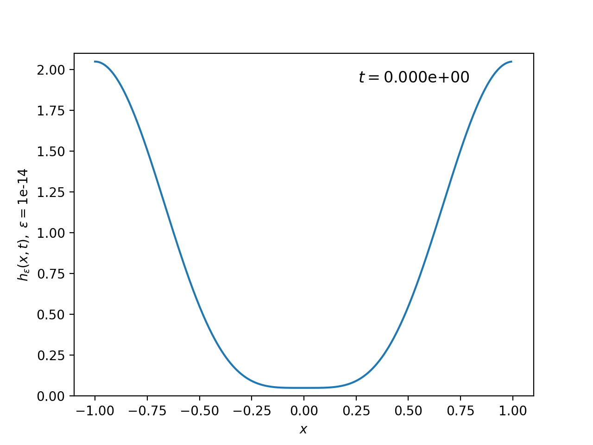

Implementation of the Generic Scheme and the Entropy-Dissipating Scheme for the regularized problem in Section 9 of "Positivity-preserving numerical schemes for
lubrication-type equations" by Zhornitskaya and Bertozzi (https://doi.org/10.1137/S0036142998335698).

The simulations are done using jax 0.5.0 and Python 12. However, the code should work with the more recent jax and Python 14 as well.

For some reason, the ylabel of eds_coarse_1e-3.png is partially cut off. This should not be super complicated to fix though. 

Here is an animation of how the solution evolves overtime produced using adaptive timestepping.

